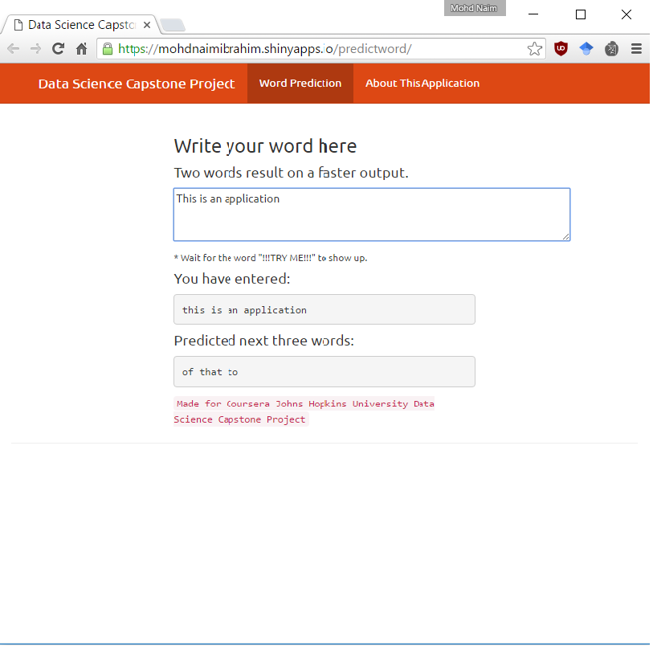

### Coursera Data Science Capstone Project

This application is the capstone project for the Coursera Data Science specialization.

******

#### Objective

The goal of this exercise is to create a product to highlight the prediction algorithm that we have built and to provide an interface that can be accessed by others.

All text data that is used to create a frequency dictionary and thus to predict the next words comes from a corpus called [HC Corpora](http://www.corpora.heliohost.org/). 

******

#### Methods & Models

From HC Corpora data, we created data sample and then cleaned it by conversion to lowercase, removing punctuation, links, white space, numbers and all kinds of special characters.
This data sample was then [tokenized](http://en.wikipedia.org/wiki/Tokenization_%28lexical_analysis%29) into so-called [*n*-grams](http://en.wikipedia.org/wiki/N-gram). 

Those aggregated bi-,tri- and quadgram term frequency matrices have been transferred into frequency dictionaries.

The resulting data.frames are used to predict the next word in connection with the text input by a user of the described application and the frequencies of the underlying *n*-grams table.

******

#### The Usage Of The Application

You can write sentence with punctuations and in different lines. However, it will interpret as a full word without these characters.

The prediction function is based on a few steps. First the software recognize which is the first letter in the word to be searched for. Afterwards, it recognizes if it is a 3-gram, 4-gram or a 5-gram search by the number of words present in the phrase. Then it loads the right n-gram that represent that exact first letter.
Afterwards the search for similar words occurs in 3 major steps:

If you have written 2 words, the software will search in a database composed by 3-grams.
If you have written 3 words, the software will search in a database composed by 4-grams, if there is less than 3 words for the prediction, the software will transform to a 2 word phrase and execute step 1.
If you have written 4 words or more, the software will select the last 4 words and search in a database composed by 5-grams, if there is less than 3 words for the prediction, the software will transform to a 3 word phrase and execute step 2.
Therefore, searches with 4 words or more are slower than the others; however, its accuracy also increase. In each of these last 3 steps, if any of the returned word is a swearword present in the "swearword dictionary" the function will remove this curse word as one possible next word prediction. Furthermore, if the new search result has any repeated word, these words are automatically removed from the prediction and a new step is followed until it completes the minimal 3 word necessary. If the function ends, and the minimal 3 words is not found, it returns the amount of words that were found ultil that last step.

Each n-gram search, besides searching for the exact word, also tries to find similar words within the database. This search consist by three steps:

If the desired sequence is not found, last written word is divided in half, and a similar word with the first half characters is used for the search.
If the desired sequence is not found, last written word is divided in half, and a similar word with the second half characters is used for the search.
If the desired sequence is not found, the software picks only the last 3 characters and search for all database with the same last characters.
If none of these conditions is meet for each of the n-grams searches, the software will return:

    "Sorry no prediction for your word". 

******

#### Additional Information

* The next word prediction app is hosted on shinyapps.io: [https://mohdnaimibrahim.shinyapps.io/predictword/](https://mohdnaimibrahim.shinyapps.io/predictword/)

* The whole code of this application, as well as all the milestone report, related scripts, this presentation  etc. can be found in this GitHub repo: [https://github.com/mhnierhoff/CapstoneCoursera](https://github.com/mhnierhoff/CapstoneCoursera)

* This pitch deck is located here: [http://rpubs.com/nierhoff/cdsc](http://rpubs.com/nierhoff/cdsc)

******

